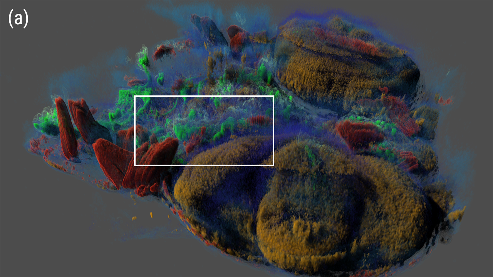
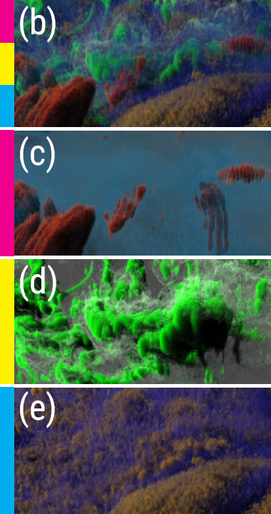

# Multi-Density Woodcock Tracking: Efficient & High-Quality Rendering for Multi-Channel Volumes 
#### Alper Sahistan, Stefan Zellmann, Nate Morrical, Valerio Pascucci, and Ingo Wald

<!-- Insert two images of equal height here they need to stay on the same line-->
 

**Abstract:**
  *Volume rendering techniques for scientific visualization have increasingly transitioned toward Monte Carlo (MC) methods in recent years due to their flexibility and robustness. However, their application in multi-channel visualization remains underexplored. Traditional compositing-based approaches often employ arbitrary color blending functions, which lack a physical basis and can obscure data interpretation. We introduce multi-density Woodcock tracking, a simple and flexible extension of Woodcock tracking for multi-channel volume rendering that leverages the strengths of Monte Carlo methods to generate high-fidelity visuals. Our method offers a physically grounded solution for inter-channel color blending and eliminates the need for arbitrary blending functions. We also propose a unified blending modality by generalizing Woodcock’s distance tracking method, facilitating seamless integration of alternative blending functions from prior works. Through evaluation across diverse datasets, we demonstrate that our approach maintains real-time interactivity while achieving high-quality visuals by accumulating frames over time.*

This is a repository for the paper ["Multi-Density Woodcock Tracking: Efficient & High-Quality Rendering for Multi-Channel Volumes"](https://alpers-git.github.io/personal-website/research/multi-densityWT.pdf) presented at The Eurographics Symposium on Parallel Graphics and Visualization (EGPGV) 2025.

### Requirements
- NVIDIA RTX GPU with NVIDIA drivers
- CUDA 11.8 or higher
- CMake 3.16 or higher
- Optix 7.5 or higher
- OpenGL
- Windows 10+ or Linux 22.04+ OS

**Note:** You can follow [Ingo's blog](https://ingowald.blog/installing-the-latest-nvidia-driver-cuda-and-optix-on-linux-ubuntu-18-04/) for most of these requirements on Linux. Installing all of these are trivial on Windows.

### Clone and build the repository
```bash
git clone git@github.com:alpers-git/MDWTracker.git
cd dtracker
mkdir build
cd build
cmake ..
make -j  # If you use Windows, you need to use cmake --build instead
```
### Important Notes
- The CMake may complain about missing OptiX_ROOT_DIR. You can set the variable manually in your CMakeCache.txt file. Then try to build again. If you are using Windows, you can set the variable in the CMake GUI.

- The paper mentions 2 different methods for Multi-Density Woodcock Tracking. The  repository it self is a bit more messy and has more options than what we report in the paper. To run with those methods you need to use ```-m ``` parameter. Use ```-m 0``` for the N-DDA method and ```-m 2``` for the syncDDA method. ```-m 1``` is a less efficient version of the syncDDA method. It is not recommended to use it. 

- ```-m 3``` is the method we describe in the supplementary material. 

- Although the viewer seems to accept unstructured grids, it is not fully implemented/broken do not use ```-fu``` parameter when calling the viewer. Use ```-fr``` for structured grids. The file name is used to determine the parameters of the dataset. Format is as follows:
  - ``` <dataset_name>_<dimensionx>x<dimensiony>x<dimensionz>_<number_formant: uint8, float32, double64...>.raw ```
    - For example, ```-fr zebrafish_256x256x256_uint8.raw``` will load a binary 3D volume of size 256x256x256 with of uint8 format. The viewer will automatically detect the number of channels and the format of the data.

- The rest of the parameters are explained in the help message. You can run the viewer with ```./mdwtViewer -h``` to see all the parameters. 
- Users may use ```!``` to take screenshots ```-/+``` keys to change dt during WT or marching, ```x/y/z``` to change camera up vector, ```r_shift+t``` to save transfer function and ```r_shift+c``` to print out the current camera parameters as a command for the next run.

##### Feel free to contact us for any questions, issues, or follow-up work.
[Alper Sahistan](https://alpers-git.github.io/personal-website/)
